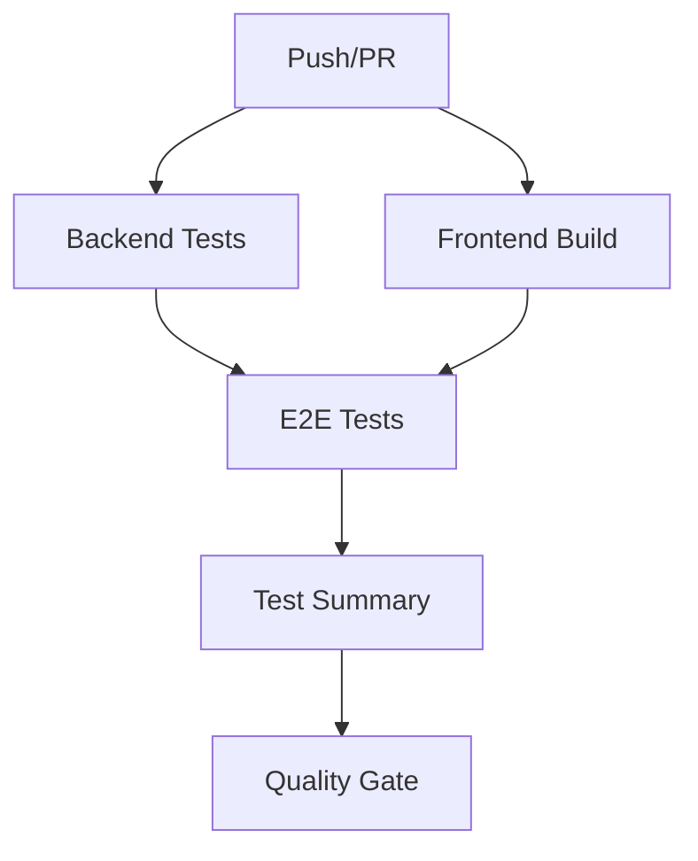

# Pipeline CI/CD - Hotel Management System

## Descripción General

Este pipeline automatizado de GitHub Actions ejecuta todas las pruebas del sistema de gestión hotelera, incluyendo:

- **Backend Integration Tests**: 39 pruebas de persistencia de datos
- **E2E Tests con Cypress**: 4 archivos de pruebas end-to-end
- **Generación de reportes**: Resultados detallados de todas las ejecuciones

## Flujo del Pipeline



## Jobs del Pipeline

### 1. Backend Build & Integration Tests
**Duración estimada**: ~2-3 minutos

- Restaura dependencias .NET
- Compila el proyecto en modo Release
- Ejecuta 39 pruebas de integración
- Genera reporte TRX
- Sube artefactos de build

**Tecnologías**:
- .NET 9.0
- xUnit
- Entity Framework Core InMemory

**Pruebas ejecutadas**:
- ClienteRepositoryTests (8 tests)
- HabitacionRepositoryTests (9 tests)
- HuespedRepositoryTests (12 tests)
- ReservaRepositoryTests (10 tests)

### 2. Frontend Build
**Duración estimada**: ~1-2 minutos

- Instala dependencias npm
- Compila el proyecto Vue.js
- Genera build de producción
- Sube artefactos del dist/

**Tecnologías**:
- Node.js 20.x
- Vue.js 3
- Vite

### 3. E2E Tests (Cypress)
**Duración estimada**: ~5-8 minutos

Ejecuta en paralelo (matriz) las siguientes pruebas:

1. **00-navigation.cy.ts**: Navegación entre páginas
2. **01-cliente-pairwise.cy.ts**: CRUD de clientes (Pairwise Testing)
3. **02-huesped-pairwise.cy.ts**: CRUD de huéspedes (Pairwise Testing)
4. **03-reserva-pairwise.cy.ts**: CRUD de reservas (Pairwise Testing)

**Proceso**:
- Inicia backend API en http://localhost:5000
- Inicia frontend en http://localhost:5173
- Ejecuta Cypress en modo headless
- Captura screenshots en caso de fallos
- Graba videos de todas las ejecuciones

**Tecnologías**:
- Cypress 13.x
- Chrome browser
- GitHub Actions

### 4. Test Summary
**Duración estimada**: ~30 segundos

- Genera resumen markdown
- Publica en GitHub Actions Summary
- Incluye estado de cada tipo de test

### 5. Quality Gate
**Duración estimada**: ~10 segundos

- Verifica que todos los tests pasen
- Bloquea PRs con tests fallidos
- Solo se ejecuta en Pull Requests

## Triggers del Pipeline

### Automático
```yaml
on:
  push:
    branches: [ main, develop ]
  pull_request:
    branches: [ main, develop ]
```

### Manual
```yaml
workflow_dispatch:
```

Puedes ejecutar el pipeline manualmente desde:
**Actions → CI/CD Pipeline → Run workflow**

## Reportes Generados

### Backend Tests
- **Formato**: .NET TRX (Test Results XML)
- **Ubicación**: `backend/Tests/TestResults/test-results.trx`
- **Visualización**: GitHub Actions Test Reporter

### E2E Tests
- **Screenshots**: Solo en caso de fallos
- **Videos**: Todas las ejecuciones
- **Ubicación**: Artefactos de GitHub Actions
- **Retención**: 7 días

## Ver Resultados

### En GitHub Actions UI
1. Ve a **Actions** en tu repositorio
2. Selecciona el workflow run
3. Revisa cada job:
   - Verde = Exitoso
   - ❌ Rojo = Fallido
   - 🟡 Amarillo = En progreso

### Summary Tab
Cada ejecución genera un resumen con:
- Estado de backend tests
- Estado de E2E tests
- Información del commit
- Fecha y hora de ejecución

### Descargar Artefactos
Si necesitas revisar en detalle:
1. Navega al workflow run
2. Scroll hasta "Artifacts"
3. Descarga:
   - `cypress-screenshots-*` (solo si hay fallos)
   - `cypress-videos-*` (siempre disponibles)

## 🛠️ Ejecución Local

### Backend Tests
```bash
cd backend
dotnet test Tests/HotelManagement.Tests.csproj --verbosity normal
```

### E2E Tests
```bash
# Terminal 1: Iniciar backend
cd backend
dotnet run

# Terminal 2: Iniciar frontend
cd frontend
npm run dev

# Terminal 3: Ejecutar Cypress
cd frontend
npx cypress run
# o en modo interactivo:
npx cypress open
```

## Métricas del Pipeline

| Métrica | Valor |
|---------|-------|
| **Total Tests** | 43+ (39 integración + 4 E2E) |
| **Tiempo Total** | ~10-15 minutos |
| **Jobs Paralelos** | 2 (Backend + Frontend) |
| **E2E Paralelos** | 4 specs en matriz |
| **Cobertura Backend** | 100% de repositorios |

## Configuración de Variables

### Secrets necesarios
Ninguno actualmente requerido (todo está en código público)

### Variables de entorno
```yaml
DOTNET_VERSION: '9.0.x'
NODE_VERSION: '20.x'
```

## 🚨 Troubleshooting

### Backend tests fallan
- Verificar que todas las dependencias estén en `HotelManagement.csproj`
- Revisar que InMemoryDatabase esté disponible
- Comprobar versión de .NET en el runner

### E2E tests timeout
- Aumentar `wait-on-timeout` en el step de Cypress
- Verificar que el backend inicie correctamente
- Revisar logs del backend con `docker logs`

### Cypress no encuentra elementos
- Verificar selectores en los tests
- Asegurarse de que el frontend esté completamente cargado
- Revisar screenshots y videos en artefactos

## 📝 Próximas Mejoras

- [ ] Agregar code coverage para backend
- [ ] Implementar cache de dependencias .NET
- [ ] Añadir análisis de código estático (SonarQube)
- [ ] Crear ambiente de staging para deploy automático
- [ ] Integrar tests de performance con k6
- [ ] Agregar notificaciones de Slack/Discord

## 📚 Referencias

- [GitHub Actions Docs](https://docs.github.com/en/actions)
- [Cypress GitHub Action](https://github.com/cypress-io/github-action)
- [.NET Test Reporter](https://github.com/dorny/test-reporter)
- [xUnit Documentation](https://xunit.net/)

---

**Última actualización**: Noviembre 2025  
**Mantenido por**: Equipo de Desarrollo Hotel Management
